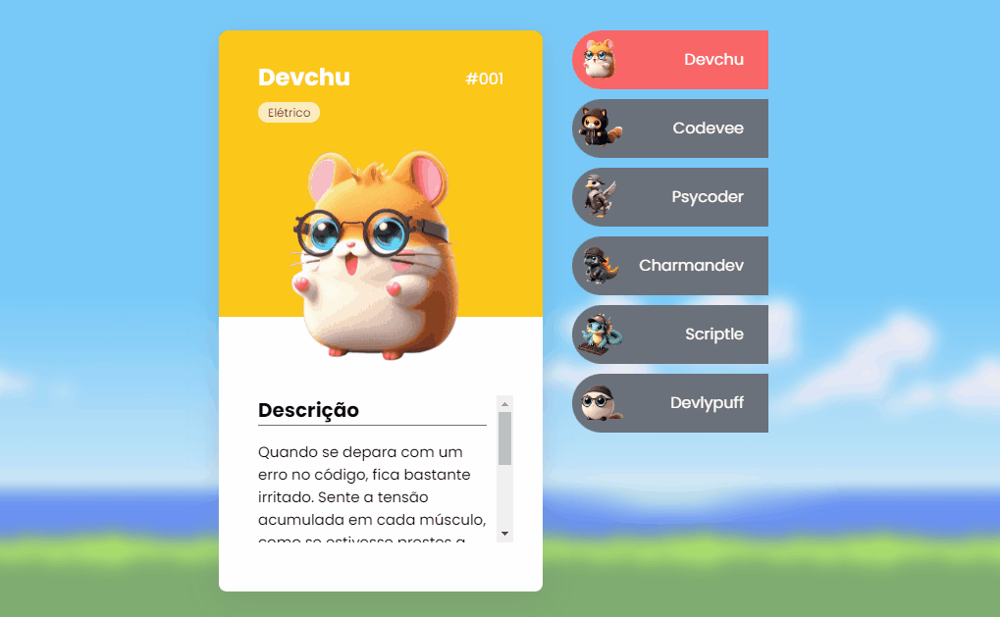
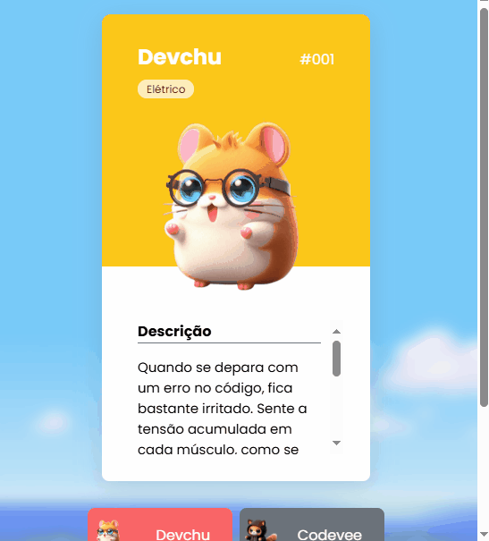

# Projeto Pokedevs
Esta é uma solução para o desafio "Pokedevs" criado na Semana do zero ao programador, promovido pelo DevQuest, que me desafiou a melhorar as minhas habilidades de codificação, por meio deste projeto realista.

## Índice

- [Visão geral](#visãogeral)
  - [O desafio](#o-desafio)
  - [Link](#link)
- [Meu processo](#meu-processo)
  - [Tecnologias utilizadas](#built-with)
  - [Aprendizados](#aprendizados)
   - [Recursos úteis](#recursos-úteis)
- [Autora](#autora)

## Visão geral

### O desafio
Consiste em realizar um layout (tanto para desktop quanto para mobile) com seis tipos de pokedevs (com nome, tipo, número de identificação e descrição geral), que possibilita ao usuário interagir e passar por cada pokedev listado.

### Link
- URL do site ativo: https://mandiilorenzo.github.io/pokedevs/ 

## Meu processo

### Tecnologias utilizadas
- HTML
- CSS
- JavaScript

### Aprendizados
 - Melhoria na prática de uso do flexbox.
 - Lógica e programação com JS.
 - Refatoração do código, para deixá-lo mais limpo.
 - Prática na responsividade em telas menores.

 ### Recursos úteis
 - Google fonts: para estilizar as fontes, conforme o desafio pediu.
 - Responsive view: maior visualização do layout em mobile, para ajustar corretamente, caso fosse necessário, a fim de trazer responsividade ao meu projeto em telas menores.
 - Perfect pixel: para auxiliar nos valores das propriedades de height, width, padding e margin, e chegar o mais próximo possível, do layout do desafio.

 ## Autora
 https://github.com/mandiilorenzo